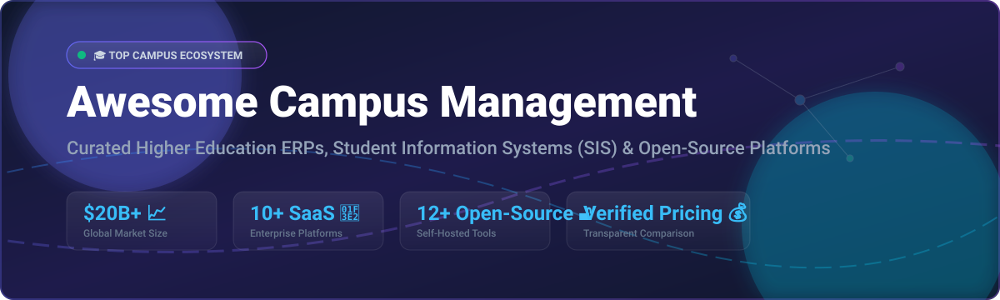

# 🎓 Awesome Campus Management & Student Information Systems (SIS) 🏫

> 🚀 **The definitive curated list of SaaS products, Education ERPs, and Open-Source GitHub Repositories for Student Information Systems (SIS), Higher Education Administration, K-12 School Management, and Campus Operations.**

---

## 📊 Market Overview & Industry Dynamics

The global **Campus Management Software & Student Information Systems (SIS)** market size is estimated at **$20.18 Billion – $29.31 Billion** (with the broader Higher Education ERP and SIS market valued at ~$12.14B). 

📈 **Market Structure**: The sector is **moderately fragmented**. While legacy enterprise giants dominate mega-university contracts, intense demand for cloud transformation, API interoperability, and specialized workflow automation has driven healthy competition among specialized SaaS platforms, regional providers, and self-hosted open-source alternatives.

---

## 📋 Table of Contents
- [🏢 SaaS & Cloud-Hosted Platforms](#-saas--cloud-hosted-platforms)
- [🔓 Open-Source GitHub Repositories](#-open-source-github-repositories)
- [🛠️ Architecture Frameworks & Solutions](#%EF%B8%8F-architecture-frameworks--solutions)
- [💖 Support & Sponsorship](#-support--sponsorship)
- [🤝 How to Contribute](#-how-to-contribute)
- [⚠️ Disclaimer](#%EF%B8%8F-disclaimer)
- [📈 Star History](#-star-history)

---

## 🏢 SaaS & Cloud-Hosted Platforms

Below is a comparative, sorted list of major commercial SaaS platforms for higher education, K-12, and trade institutions, ordered by **Company Scale / Annual Revenue (Descending)** 📉.

| 🏢 Product Name | 💵 Starting Tier Pricing | 🎁 Free Tier / Free Trial Limits | 📊 Company Scale & Revenue (Est.) | 📝 Key Features & Focus |
| :--- | :--- | :--- | :--- | :--- |
| **[Ellucian Banner](https://www.ellucian.com/)** | **~$50,000 / year** (Modular enterprise contract based on FTE) | **No Free Plan**; 14-day guided sandbox demo available upon institution request | **~$900M Revenue** (~4,300 employees; Private via Vista & Blackstone) | Comprehensive Higher Education ERP covering Student Information, HR, Finance, and Financial Aid. |
| **[Unit4 Student Management](https://www.unit4.com/)** | **~$40,000 / year** (SaaS base fee per institutional module) | **No Free Plan**; 30-day corporate sandbox trial for qualified institutions | **~$678M Revenue** (~3,400 employees; Private via TA Associates) | Cloud-native ERP & Student Management suite designed for international universities and research colleges. |
| **[Anthology Student](https://www.anthology.com/)** | **~$35,000 / year** (Enterprise quote based on student enrollment) | **No Free Plan**; Guided institutional interactive demo available | **~$450M Revenue** (~4,100 employees; Restructuring FY2025) | Unified SIS, CRM, and Admissions platform for higher ed institutions (formerly CampusNexus). |
| **[CampusCafe](https://www.campuscafe.com/)** | **$1,200 / month** (Base package including Core SIS module) | **No Free Plan**; 14-day interactive admin demo account | **~$15M Revenue** (~50 employees; Independent) | All-in-one cloud platform for K-12, career colleges, and small-to-midsize higher ed. |
| **[Classe365](https://www.classe365.com/)** | **$100 / month** (Core tier for 1–100 students) | **No Free Plan**; 14-day full feature free trial (No credit card required) | **~$10M Revenue** (4,500+ institutions across 130+ countries) | Modern student management and LMS with integrated CRM, fee invoicing, and mobile app. |
| **[Populi](https://www.populiweb.com/)** | **$199 / month** (Base fee + $9/month per billable student) | **No Free Plan**; 30-day full access demo site with sample institutional data | **~$5M ARR** (~15 employees; Independent bootstrapped) | Web-based college management system integrating SIS, financial aid, LMS, and library management. |
| **[OpenEduCat Enterprise](https://openeducat.org/)** | **$75 / month** (Base cloud module subscription) | **No Free Plan**; 15-day live interactive cloud trial | **~$3M Revenue** (Global Odoo education partner ecosystem) | Enterprise-supported version of OpenEduCat built on Odoo ERP with 74+ administrative modules. |
| **[Academia ERP](https://www.academiaerp.com/)** | **~$500 / month** (Modular annual SaaS subscription) | **No Free Plan**; Custom scheduled live demo session with solution architects | **~$3M Revenue** (Serosoft Solutions; serving 300+ campuses) | Modular education ERP for schools, colleges, and university groups with multi-campus management. |

---

## 🔓 Open-Source GitHub Repositories

Below are production-ready open-source Student Information Systems, Learning Management Systems (LMS), and Educational ERP platforms, sorted by **GitHub Stars_Count (Descending)** 📉.

| 📦 Repository & Link | ⭐ GitHub_Stars_Badge | 📜 License | 🧰 Tech Stack | 📌 Overview & Scope |
| :--- | :--- | :--- | :--- | :--- |
| **[Odoo Community Edition](https://github.com/odoo/odoo)** |  | LGPL-3.0 | Python, JavaScript, PostgreSQL | Modular enterprise ERP platform with native modules adaptable for school management, admissions, and payroll. |
| **[ERPNext](https://github.com/frappe/erpnext)** |  | GPL-3.0 | Python (Frappe Framework), JS, MariaDB | Full-featured open-source ERP with built-in Education module for student records, fees, and course scheduling. |
| **[Open edX Platform](https://github.com/openedx/openedx-platform)** |  | AGPL-3.0 | Python, Django, React | World-class open online learning platform powering university MOOCs, course delivery, and student assessments. |
| **[Moodle LMS](https://github.com/moodle/moodle)** |  | GPL-3.0 | PHP, MySQL / PostgreSQL | The world's most popular open-source Learning Management System featuring assignment grading, quizzes, and course tracking. |
| **[Canvas LMS](https://github.com/instructure/canvas-lms)** |  | AGPL-3.0 | Ruby on Rails, React, PostgreSQL | Open-source core of the industry-standard Canvas LMS for higher education course administration and grading. |
| **[Chamilo LMS](https://github.com/chamilo/chamilo-lms)** |  | GPL-3.0 | PHP, MySQL | E-learning and content management platform focused on ease of use and accessibility for schools and universities. |
| **[OpenEduCat Core](https://github.com/openeducat/openeducat_erp)** |  | LGPL-3.0 | Python (Odoo Framework), XML | Comprehensive educational ERP built on Odoo with 74+ modules for admission, faculty, exam, and timetable management. |
| **[Frappe Education](https://github.com/frappe/education)** |  | GPL-3.0 | Python (Frappe Framework), JS | Modern, lightweight education management app built on Frappe Framework for student attendance, fees, and grading. |
| **[RosarioSIS](https://github.com/francoisjacquet/rosariosis)** |  | GPL-2.0 | PHP, PostgreSQL | Flexible web-based Student Information System featuring demographics, gradebook, attendance, billing, and food service. |
| **[Gibbon Core](https://github.com/GibbonEdu/core)** |  | GPL-3.0 | PHP, MySQL | Clean, modular school management platform designed by teachers for attendance, timetabling, gradebook, and planner. |
| **[Fedena](https://github.com/projectfedena/fedena)** |  | Apache-2.0 | Ruby on Rails, MySQL | Proven school management software deployed across 40,000+ institutions with online admission, fee management, and examination. |
| **[openSIS Classic](https://github.com/OS4ED/openSIS-Classic)** |  | GPL-2.0 | PHP, MySQL / MariaDB | Commercial-grade Student Information System for K-12 and higher ed with scheduling, transcripts, and report cards. |

---

## 🛠️ Architecture Frameworks & Solutions

When building custom campus management ecosystems, architects typically combine best-of-breed open-source tools:
- 🏫 **Core SIS & Student Records**: Deploy **openSIS Classic** or **RosarioSIS** for lightweight, direct student demographic and gradebook administration.
- 🏢 **Enterprise Campus ERP**: Implement **OpenEduCat** or **ERPNext Education** for full institutional accounting, HR, payroll, and asset management.
- 📚 **Teaching & Learning (LMS)**: Integrate **Moodle** or **Canvas LMS** via LTI (Learning Tools Interoperability) standards to handle assignments, online quizzes, and digital classrooms.

---

## 💖 Support & Sponsorship

Thank you for exploring the **Awesome Campus Management** repository! If you find this curated ecosystem list helpful, please consider supporting the project:

- ⭐ **Star** this repository to increase visibility for educators and developers.
- 🍴 **Fork** and share it with your IT team, university colleagues, or community.
- ☕ **Buy me a coffee / Sponsor**: If you'd like to support ongoing curation and open-source maintenance, check out the [GitHub Sponsor Dashboard](https://github.com/sponsors/ishandutta2007).

---

## 🤝 How to Contribute

Contributions are highly welcome! 🌟 Follow these steps to submit additions:
1. 🍴 Fork this repository.
2. 📝 Edit `README.md` following the standard table formatting.
3. 🔎 Ensure all entries include verified pricing details, company metrics, or accurate GitHub repository links.
4. 🚀 Open a Pull Request with a clear description of your changes.

---

## ⚠️ Disclaimer

- ℹ️ This repository is a community-curated collection for informational and research purposes.
- 🔒 Campus management systems must strictly comply with regional student privacy regulations (**FERPA, GDPR, COPPA, HIPAA**).
- 🛠️ Self-hosted deployments require ongoing maintenance, database security hardening, and regular encrypted backups.

---

## 📈 Star History

---

**Made with ❤️ for School Administrators, Registrars, University IT Directors, and EdTech Developers.**
